# Team Chat

> 自己搭、自己管、自己玩。给个人、家庭、朋友、学习搭子和小团队准备的自托管聊天室。


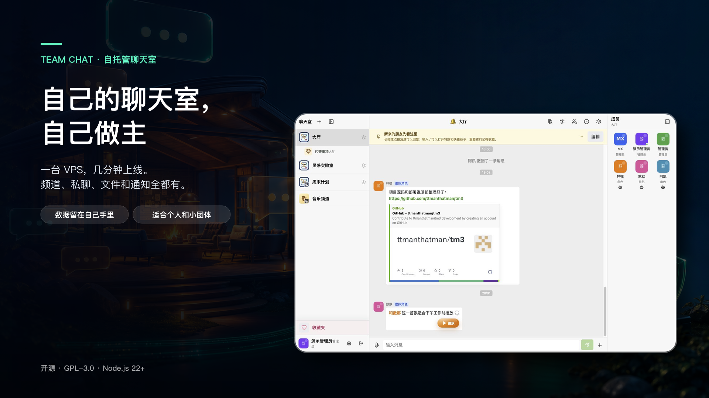

Team Chat 不是“只能发两句话”的聊天 Demo。它有公开频道、私密频道、一对一私聊、图片、文件、语音、视频、回复、收藏、置顶、浏览器通知、消息特效、音乐曲库、歌谱、同步歌词、主题和完整管理后台，而且手机和电脑都能舒服地用。

最重要的是：服务、账号和数据都在你自己的服务器上。几个人可以用，几十人的小团体也可以用；不需要先学会一堆运维黑话。

## 先看一眼

以下界面来自运行最新 `main` 版本的 Demo 环境，展示数据均为专门制作的示例内容。

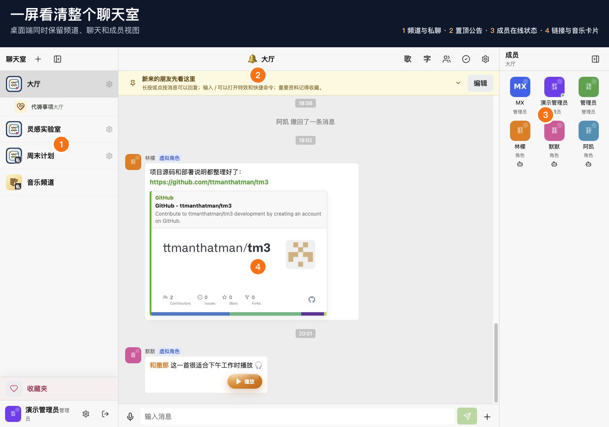

1. 左边是公开频道、私密频道、私聊和收藏夹。
2. 中间是消息流，文字、媒体、回复和卡片都待在一起。
3. 右边能看到频道成员、在线状态和虚拟角色。
4. 顶部入口可打开曲库、歌谱、持续跟进卡片和频道设置。

手机端没有把桌面版硬塞进窄屏，而是把频道、聊天和成员拆成顺手的单列操作：

<p align="center">
  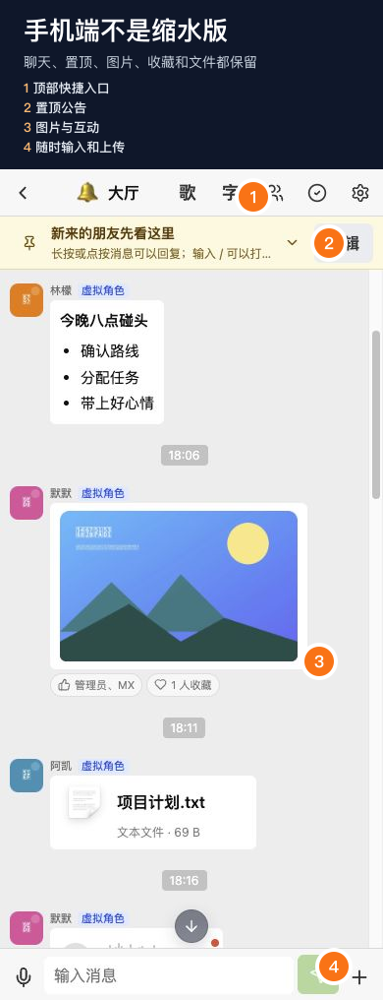
</p>

## 它到底能干什么

### 频道和私聊：该热闹时热闹，该安静时安静

- 公开频道适合大厅、公告和随手聊。
- 私密频道只让指定成员进入，历史消息也按权限保护。
- 一对一私聊不会混进公共频道；从列表关闭只影响自己，不会顺手删掉历史。
- 支持频道图标、说明、成员管理、置顶消息和按频道静音。
- 在线状态、输入中提示、未读提醒和浏览器推送都是实时的。

### 消息：能打字，也能整活

文字支持安全的 Markdown 和链接预览，还可以发送图片、普通文件、音频、视频和语音。语音会显示波形、时长、进度和未收听状态；上传失败也能直接重试。

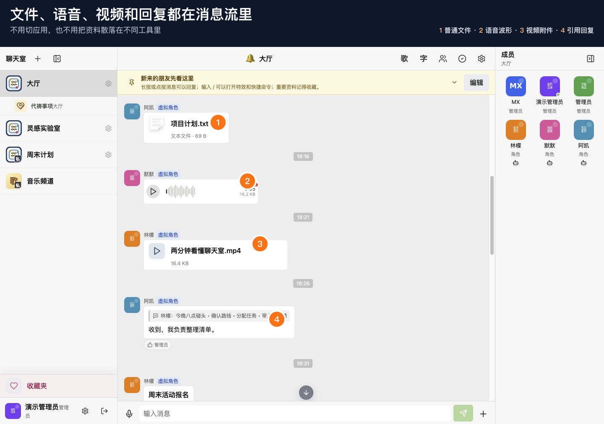

1. 图片可直接预览，点开后能缩放和拖动。
2. PDF、Office、文本等常见文件会显示对应图标。
3. 语音带波形、进度、时长和已读状态。
4. 视频和音频可以留在聊天流里直接打开。
5. 点按或长按消息即可回复，引用关系一眼能看懂。

日常操作也没少：

- 输入 `@` 选择成员，被点名的人会收到可定位的提醒。
- 点赞和收藏可以把重要内容从滚滚消息里捞回来。
- 自己的消息在允许时间内可以撤回，管理员也能批量整理记录。
- 接龙消息适合报名、值班、拼单和清单，不用再手工复制上一条。
- 管理员可以从多条消息整理出频道置顶，普通成员也可以被单独授权维护置顶。

### 11 种消息特效

在输入框敲 `/` 就能看到命令，不用死记。特效会跟着消息一起保存，别人看到的不是“你本地自嗨”。

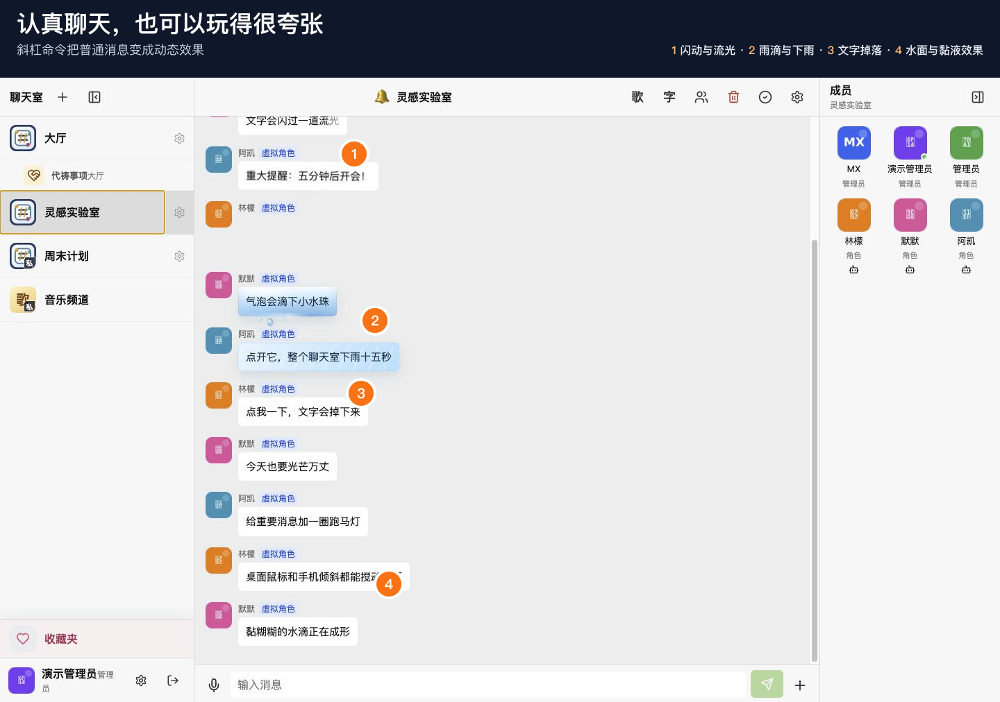

1. `/闪动`、`/流光`、`/震动`：让重点消息真的有重点。
2. `/飞机`、`/跑马灯`、`/光芒万丈`：适合庆祝、提醒和气氛组。
3. `/水波`、`/水滴`：手机倾斜或桌面鼠标划过时还能互动。
4. `/下雨`：整个聊天区下一场 15 秒的大雨。
5. `/哎呀`：文字会掉下来、碰撞、堆叠，再点一下还能归位。

### 曲库、歌谱和同步歌词

音乐不是聊天框边上的一个孤零零播放键。频道可以维护完整播放列表，支持搜索、排序、循环和热度；歌曲可以配多页歌谱，并用 LRC 或 SRT 显示同步歌词。

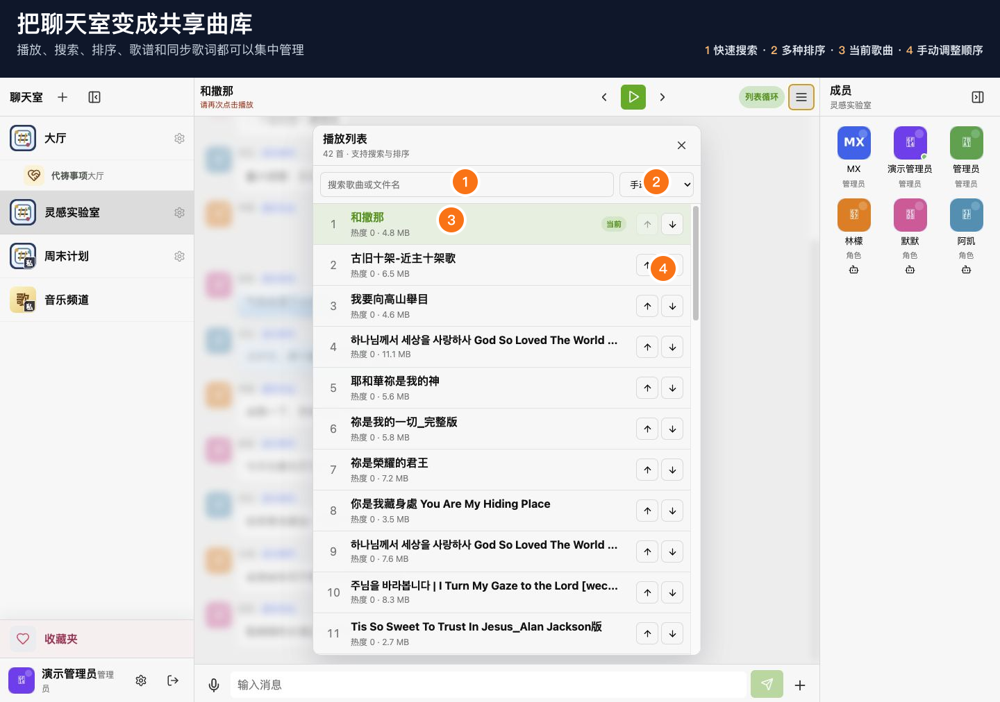

1. 频道顶部可以播放上一首、下一首并切换循环方式。
2. 播放列表支持搜索和手动排序。
3. 当前歌曲会高亮，曲目也可以直接提到聊天里。
4. 有歌谱的歌曲可打开多页图片谱。
5. 增强歌词会跟随播放进度显示，不挡住正常聊天。

<p align="center">
  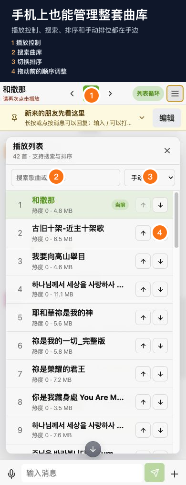
</p>

### 持续跟进卡片

有些事情不是发完一句话就结束。内置的 `/代祷` 卡片可以记录状态、参与者、次数和最新动态；更新后会重新回到消息流顶部，同时保留原有统计。频道里也有单独的集中视图，适合长期事项。需要时还可以开启 AI，只推荐相关出处并使用内置文本库展开原文；AI 密钥只保存在服务端。

<p align="center">
  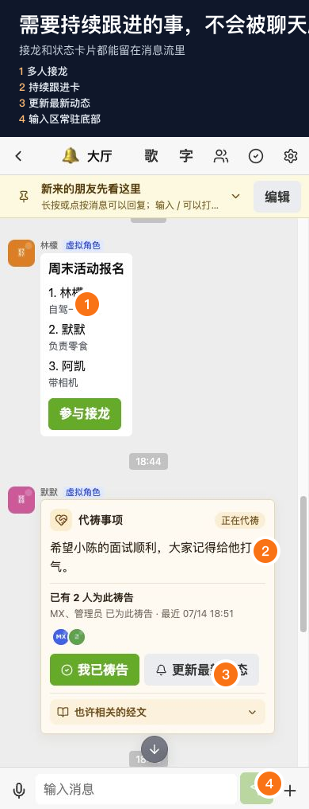
</p>

### 外观：别让自己的站看起来像租来的

- 内置多套明暗主题，管理员还能调整按钮、面板、文字和消息气泡颜色。
- 聊天壁纸支持填满、适合、拉伸和平铺。
- 多层卷轴背景会随着消息滚动，速度、顺序和位置都能调。
- 登录页的图标、标题、副标题、背景和表单位置可以独立设置。
- 手机安全区、软键盘、Safari 底栏和“添加到主屏幕”都做了适配。

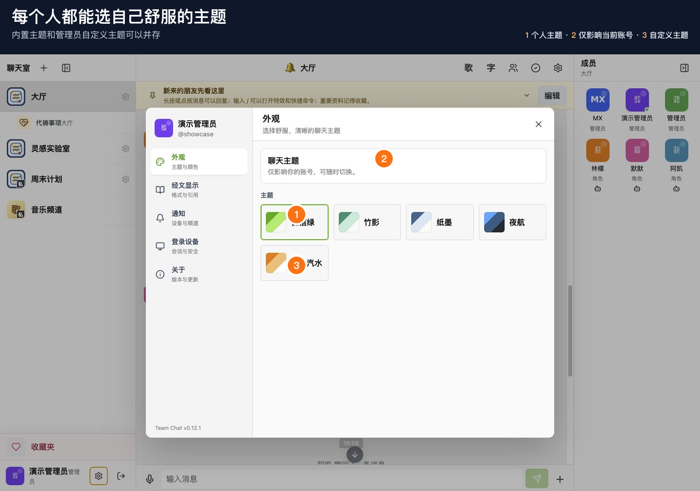

1. 普通成员可设置主题、通知和自己的使用偏好。
2. 管理员可进入外观编辑器调整整站视觉。
3. 图片和主题先预览、后保存，不会点一下就把全站改花。

### 后台：管理员不需要直接改数据库

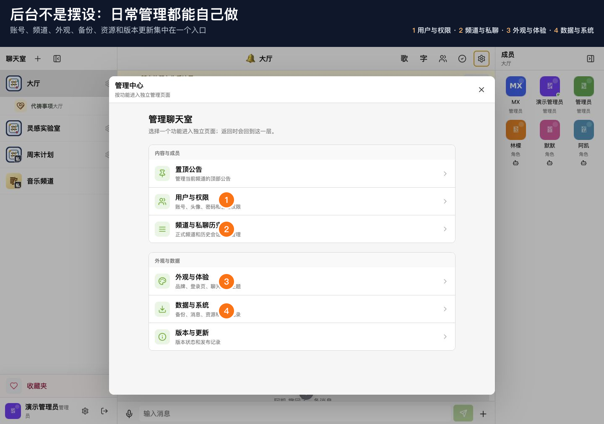

1. 创建用户、改显示名、重置密码和分配管理员权限。
2. 创建公开或私密频道，管理成员、图标和历史可见范围。
3. 搜索、删除或清空消息，整理置顶和附件资源。
4. 查看登录记录，导入导出数据，下载用户附件。
5. 识别丢失文件、压缩图片、批量清理不再需要的资源。
6. 查看当前版本和更新记录，并按部署配置执行更新。

## 五分钟上手

### 1. 建账号和频道

用管理员账号登录，打开右上角设置进入管理后台。先创建成员，再创建频道；私密频道记得把成员加入进去。大厅一类的公共频道可以留给所有人。

### 2. 发消息

- 直接输入文字并回车发送。
- 点输入框旁的 `+` 发送图片、文件、音频或视频。
- 点麦克风录语音。
- 输入 `@` 找人，输入 `/` 看全部命令。
- 点按手机消息、长按桌面消息可以回复；消息菜单里还能点赞、收藏、撤回或管理。

### 3. 开启通知

点顶部铃铛或进入个人设置，允许浏览器通知，然后发一条测试通知。每台设备都要单独授权；不想被某个频道吵到，可以只静音那个频道。

### 4. 加音乐和歌谱

进入目标频道，打开顶部音乐入口。管理员上传音频后可以调整顺序、补充歌谱图片和同步歌词。普通成员可播放、切歌、查看歌谱并把歌曲带进聊天。

### 5. 先做一次备份

账号、频道和消息在数据库里，上传文件在 `STORAGE_ROOT` 指向的目录里。真正能恢复的备份必须同时包含数据库、存储目录和 `.env`；只复制源码不算备份。

## 一键部署到 VPS

建议准备一台全新的 Ubuntu 或 Debian VPS。要使用 HTTPS，先把自己的域名解析到服务器。

```bash
curl -fsSL https://raw.githubusercontent.com/ttmanthatman/tm3/main/scripts/deploy-vps.sh -o deploy-vps.sh
sudo env DOMAIN=chat.example.com EMAIL=you@example.com bash deploy-vps.sh
```

脚本会自动安装 Node.js 22、MySQL、Nginx、PM2、ffmpeg 和编译工具，创建数据库与密钥，构建应用，启动服务并配置 HTTPS。最后会输出初始管理员信息，请立刻保存并修改密码。

暂时没有域名，也可以先用服务器 IP 和 HTTP：

```bash
curl -fsSL https://raw.githubusercontent.com/ttmanthatman/tm3/main/scripts/deploy-vps.sh -o deploy-vps.sh
sudo bash deploy-vps.sh
```

常用命令：

```bash
pm2 status team-chat
pm2 logs team-chat
pm2 restart team-chat --update-env
```

### 部署后别漏掉这几件事

- 修改管理员密码，关闭不需要的公开注册。
- 确认 `.env`、数据库和存储目录不会被 Web 服务器直接访问。
- 为数据库与存储目录安排定时备份，并实际试恢复一次。
- 开启 HTTPS 后再启用浏览器推送通知。
- 更新前先备份；更新后检查登录、发消息、上传和通知。

## 手动安装与开发

环境要求：Node.js 22+、MySQL 兼容数据库，以及用于语音转码的 `ffmpeg`。

```bash
git clone https://github.com/ttmanthatman/tm3.git
cd tm3
npm install
cp .env.example .env
```

编辑 `.env`，至少设置数据库连接、JWT 密钥、管理员初始密码和存储目录，然后初始化并启动：

```bash
npm run prisma:generate
npm run prisma:push
npm run build
npm start
```

开发模式：

```bash
npm run dev
```

提交前检查：

```bash
npm run check:quick
npm run test:ui-logic
npm run test:security
```

更详细的模块地图和回归检查见 [开发索引](docs/development-index.md)。

## 配置速查

| 变量 | 用途 |
| --- | --- |
| `DATABASE_URL` | MySQL 连接地址 |
| `JWT_SECRET` | 登录令牌签名密钥，务必使用长随机值 |
| `DEFAULT_ADMIN_PASSWORD` | 首次初始化管理员密码 |
| `STORAGE_ROOT` | 上传、头像、歌谱和外观资源的存储目录 |
| `CORS_ORIGINS` | 允许访问 API 的站点来源 |
| `PUSH_NOTIFICATIONS_ENABLED` | 是否允许发送 Web Push |
| `VAPID_SUBJECT` / `VAPID_*_KEY` | 浏览器推送配置 |
| `AI_SETTINGS_SECRET` | 可选 AI 配置的加密密钥 |
| `UPDATE_REPO_URL` / `UPDATE_BRANCH` | 应用内更新来源 |
| `UPDATE_RESTART_MODE` | 更新后使用 `pm2`、自定义命令或不自动重启 |

完整示例见 [.env.example](.env.example)。生产环境不要把 `.env`、数据库、上传文件、服务器地址或内部部署说明提交到仓库。

## 海报素材

仓库附带 3 个主题，每个主题都有桌面横屏 `1920×1080` 和手机竖屏 `1080×1920` 两种版本，没有方形裁切。

| 自己的聊天室，自己做主 | 消息，不必一本正经 | 聊天、曲库、后台，一套就够 |
| --- | --- | --- |
| [横屏](docs/images/posters/self-host-desktop.png) · [竖屏](docs/images/posters/self-host-mobile.png) | [横屏](docs/images/posters/expressive-chat-desktop.png) · [竖屏](docs/images/posters/expressive-chat-mobile.png) | [横屏](docs/images/posters/music-control-desktop.png) · [竖屏](docs/images/posters/music-control-mobile.png) |

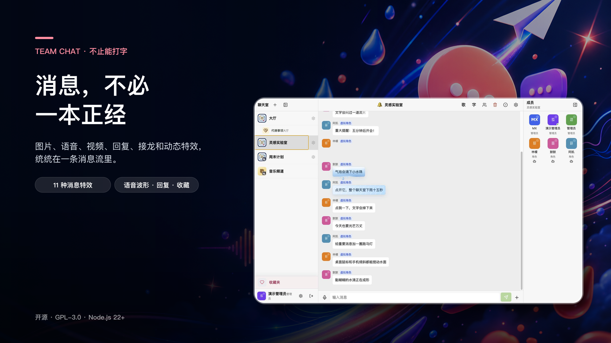

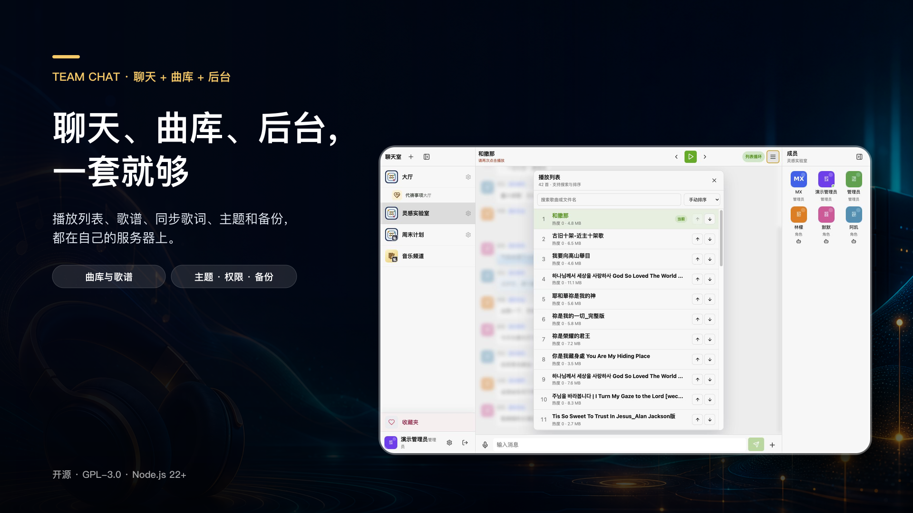

## 数据、安全和开源许可

- 密码使用哈希保存；管理员看不到成员原密码，只能重置。
- 文本内容会在服务端清洗，上传路径和资源访问都有权限检查。
- AI、推送和更新相关密钥只应保存在服务端环境变量或加密设置中。
- 运行时数据不要进 Git；发布前可运行 `npm run check:public-tree` 自检。
- 本项目以 [GPL-3.0-only](LICENSE) 发布。修改并向他人提供服务前，请先了解许可证义务。

想要一个只属于自己那群人的聊天地方？把它搭起来，然后慢慢折腾成你们喜欢的样子。
