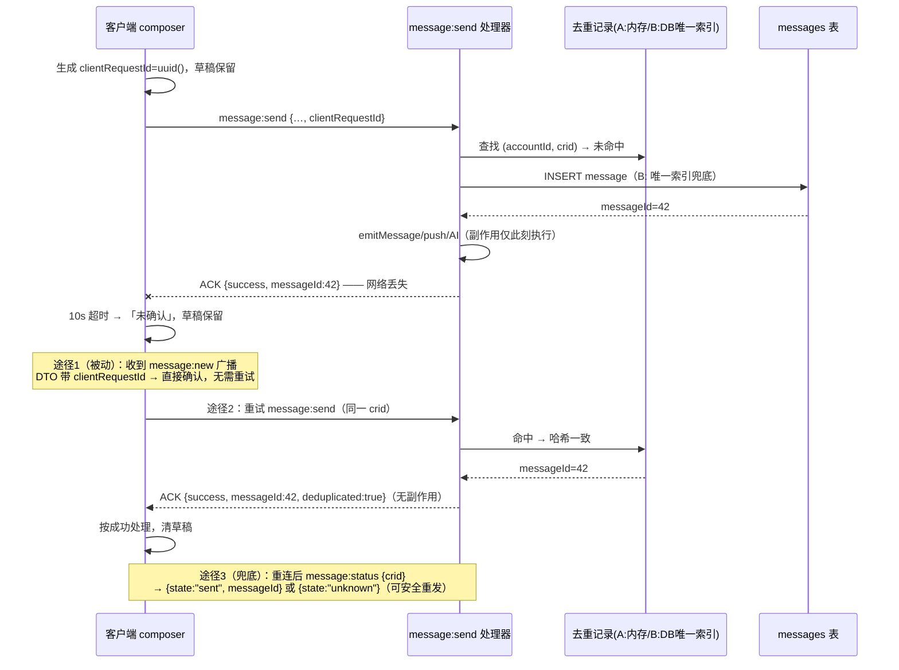

# 消息发送 ACK 丢失恢复设计（S4）

> 设计基线与模拟记录。2026-09-22 已实现方案 B 的消息唯一键、请求哈希、Socket 重放/状态查询、广播回显和客户端手动重试；未启用自动重发。
> 下文“现状”和“草案”段落保留实施前的分析语境，当前行为以源码和迁移为准。
> 模拟脚本：`output/s4-ack-recovery-sim.ts`（`node --import tsx` 运行，结果摘要见文末）。

## 1. 问题

`message:send` 走 socket ACK 确认（10s 超时）。服务端在 `createMessageFromActor` 内一次性完成「落库 + 广播 `message:new` + push + engine 事件 + AI 助手触发」。若落库成功但 ACK 在网络中丢失，客户端只知道「未确认」（`src/client/messageSending.ts:38-44`，保留草稿并提示"请先检查消息列表后再重试"）。用户手动重发会再落一条消息，且 push/AI 等副作用全部重复执行。

现状关键代码：

- 客户端：`src/client/messageSending.ts:14-57`（`useMessageSender`，`pending` 挡并发点击，超时即放弃）；`src/client/features/composer/useComposer.ts:323-341`（组装 payload、按结果清/留草稿）。
- 服务端：`src/server/index.ts:4147-4196`（`message:send` 处理器，zod 校验体当前**无**请求标识字段）；`src/server/index.ts:2156-2200`（`createMessageFromActor`：`prisma.message.create` → `emitMessage` → `sendMessagePush` → `createEngineEvent` → `maybeTriggerWhyDirectAssistant`/`maybeTriggerQuestionAssistant`）。
- 数据模型：`prisma/schema.prisma:276`（`Message` 仅有自增 `id`，无任何客户端请求标识）。

**明确禁止"内容相同"判重**：用户连续发送同样文字是合法操作。判重只能基于客户端生成的请求标识。

## 2. 核心设计：client request id 幂等

让「重试」变成「重放」：同一发送意图携带同一 `clientRequestId`，服务端已见过就直接返回首次结果，不再落库、不再执行副作用。

### 2.1 标识生成与归属

- 由客户端在**每次发送意图**（用户点击发送/按 Enter）时用 `crypto.randomUUID()` 生成一个 UUID v4，随 payload 发出。
- 超时/未确认时，该 id 与草稿一起保留在「未确认发送」记录里；用户点「重试」**复用同一 id**。
- 发送成功（含被判定为重放的成功）后生成新意图时换新 id。服务端决不为客户端生成此 id（否则重试无法对齐）。

### 2.2 作用域

去重键 = `(accountId, clientRequestId)`（持久化时落在 `senderActorId` 上，actor 与账号一一对应）。

- **账号**：必须在键内——防止跨账号误去重，也让权限边界清晰。
- **频道**：不进键。重试若改了频道属于「同 id 不同内容」，按冲突处理（见 2.7）。
- **设备/会话**：故意不进键。用户在手机超时后到电脑上重试，必须能去重；同一账号新会话重试同理。

### 2.3 保留时长与清理

- 方案 A：进程内 `Map`，TTL 24 小时 + LRU 上限（如 1 万条），过期即视为「未知」，重试会重新落库（弱保证，明确接受）。
- 方案 B：`client_request_id` 直接作为 `messages` 表的可空列，随消息生命周期存在，**无需清理任务**。MySQL 唯一索引允许多个 NULL，存量行不受影响。

### 2.4 并发重复提交

两层防护：

1. **进程内 in-flight promise 合并**（两方案共有）：键首次进入时登记 Promise，并发到达的同键请求挂到同一 Promise 上，只执行一次落库。
2. **唯一约束兜底**（仅方案 B）：多进程或绕过第一层时，`INSERT` 撞唯一索引（P2002）→ 回查已有消息 → 按重放返回。因为 `createMessageFromActor` 的副作用全部排在 `create` 成功之后，撞索引的那次不会产生任何副作用。

### 2.5 服务端重启 / 多进程边界

- 方案 A：重启后 Map 清空，重启窗口内的重试会产生重复消息；多进程部署时各进程只认自己的 Map。**保证范围：单进程、进程存活期内**。当前部署为单进程 socket.io（在线状态均为进程内 Map），此边界与现状自洽，但必须写进文档与运维须知。
- 方案 B：数据库是唯一裁决者，重启与多进程下保证不变。

### 2.6 鉴权变化

- 登出/换账号：客户端清空本账号的「未确认发送」列表（localStorage 按账号键隔离，登出时清除）；服务端因键内含 accountId，新账号携带相同 id 也不会命中旧记录（模拟 S5 验证）。
- 游客账号同样有 accountId，行为一致。
- 断线重连不换 accountId，id 继续有效——这是设计所依赖的性质。

### 2.7 请求内容冲突（同 id 不同内容）

去重记录除 `messageId` 外保存请求哈希 `hash(accountId, channelId, content, type, payload, replyToId)`。同 id 命中但哈希不同 → 返回 `{ success: false, code: "conflict" }`，**不写库、不执行副作用、绝不静默替换**。客户端收到 conflict 视为普通发送失败，提示用户内容已保留。（UUID 撞库概率可忽略，冲突分支主要防调试重放与客户端 bug。）

### 2.8 结果查询 / 返回方式

客户端查明「那条消息到底发出去没有」有三条途径，按被动优先排序：

1. **广播回显（被动，首选）**：`message:new` 广播的 `MessageDTO` 增加可空 `clientRequestId` 字段。客户端收到广播时按 id 匹配未确认列表，命中即直接标记成功、清草稿，**无需任何重试**。方案 A 下服务端用进程内 `messageId → clientRequestId` 映射补挂该字段（仅覆盖 TTL 窗口内消息）。
2. **主动重试重放**：用户点「重试」复用同一 id，ACK 返回 `{ success: true, messageId, deduplicated: true }`，客户端按成功处理。
3. **状态查询（兜底）**：新增 socket 事件 `message:status`，入参 `{ clientRequestId }`，返回 `{ state: "sent", messageId }` 或 `{ state: "unknown" }`。重连后对每条未确认记录调用一次；`unknown` 表示可安全重发（服务端确实没见过）。

### 2.9 副作用去重

`createMessageFromActor` 的副作用（`emitMessage`、`sendMessagePush`、engine `message_created` 事件、`maybeTriggerWhyDirectAssistant`/`maybeTriggerQuestionAssistant`）全部以「成功插入的消息 id」为入参且排在插入之后。去重在插入**之前**拦截（重放直接返回已有记录），因此重试天然不会重复执行任何副作用——这是把去重点放在落库关口而非各副作用点的理由。push 虽有 `tag: channel-${id}` 的通知栏去重，AI 助手触发没有任何去重，所以关口拦截是必要的（模拟 S1/S2 断言 push/ai/engine 各只执行一次）。

## 3. 时序图

主路径（落库成功、ACK 丢失、恢复）：



## 4. 失败矩阵

| 场景 | 现状 | 方案 A（进程内） | 方案 B（持久唯一约束） |
|---|---|---|---|
| 落库前失败（校验/鉴权拒绝），ACK 正常 | 拒绝，草稿保留，可重试 | 同现状；拒绝**不登记**去重记录，修正内容后同 id 可重试（模拟 S7） | 同 A |
| 落库前失败，ACK 也丢失 | 重试落一条（正确） | 同现状（无记录，重试即首发） | 同现状 |
| 落库成功，ACK 丢失 → 手动重试 | **重复消息 + 副作用重复**（模拟 S0） | 去重返回原 messageId，无副作用（模拟 S1） | 同 A，且不受进程生命周期限制 |
| 两个并发重复提交（双击/双设备同账号） | 两条消息 | 同进程：in-flight 合并成一条（模拟 S2）；跨进程失效 | 同进程合并 + 唯一索引跨进程兜底（模拟 S4） |
| 服务端重启后重试 | 重复消息 | **重复消息（已知弱保证边界）**（模拟 S3） | 去重生效（模拟 S3） |
| 登出/换账号携带同一 id | 不适用（无 id） | 账号隔离，互不去重（模拟 S5） | 同 A |
| 同一 id 不同内容 | 不适用 | 返回 conflict，不写库（模拟 S6） | 同 A |
| 客户端刷新/崩溃后恢复 | 用户自行翻看列表判断 | localStorage 恢复未确认列表 → 广播回显 / message:status 确认（模拟 S8） | 同 A |
| 重试发生在去重记录过期后 | 不适用 | 重复消息（TTL 弱保证，接受） | 不存在（随消息生命周期） |

## 5. DTO 草案（`src/shared/types.ts`）

```ts
// 发送请求（message:send payload）
export interface MessageSendPayload {
  channelId: number;
  content: string;
  type?: "text" | "prayer" | "sermon_request";
  payload?: unknown;
  replyToId?: number | null;
  clientRequestId: string; // UUID v4；每次发送意图生成一次，重试保持不变
}

// ACK（服务端 message:send 回复，扩展自现有 { success, message, messageId }）
export interface MessageSendAck {
  success: boolean;
  message?: string;
  messageId?: number;
  clientRequestId?: string;   // 回显
  deduplicated?: boolean;     // true = 重放，未产生新消息/副作用
  code?: "conflict";          // 同 id 不同内容
}

// message:new 广播与消息查询 DTO（新增可空字段，兼容旧客户端）
export interface MessageDTO {
  // …现有字段…
  clientRequestId?: string | null;
}

// message:status 查询
// 请求: { clientRequestId: string }
// 响应: { state: "sent"; messageId: number } | { state: "unknown" }
```

`MessageSendResult` 客户端侧增加 `reason: "unconfirmed"` 的细化（现超时分支），UI 上草稿旁显示「未确认 · 重试」而非仅状态文案。

## 6. 最小实现文件清单（实施前草案）

方案 A（无迁移，弱保证）：

- `src/shared/types.ts`：上述 DTO 字段。
- `src/server/messageSendDedup.ts`（新增）：`Map` + in-flight promise 合并 + TTL/LRU 清理（清理定时器挂到现有 `onClose`，`src/server/index.ts:4071`）。
- `src/server/index.ts`：`message:send` zod schema 增加 `clientRequestId`；处理器先查去重再调用 `createMessageFromActor`；新增 `message:status` 事件；`hydrateMessage`/`serializeMessage` 从内存映射补挂 `clientRequestId`。
- `src/client/messageSending.ts`：payload 注入/保留 `clientRequestId`；新增 unconfirmed 结果语义。
- `src/client/features/composer/useComposer.ts`：生成/复用 id、未确认列表（localStorage 按账号键）、重试按钮、广播回显匹配。
- 测试：`src/client/messageSending.test.ts` 扩展 + 服务端 socket 处理器测试。

方案 B 在 A 的基础上：

- `prisma/schema.prisma` + 新迁移（见第 7 节）；去重存储改用 `messages.client_request_id`，`hydrateMessage` 直接从行读取；清理定时器删除。

## 7. 方案 B 迁移与验证

2026-09-22 新增 `20260922000000_message_client_request_id` 迁移，增加 `client_request_id`、`client_request_hash` 和 `(sender_actor_id, client_request_id)` 唯一索引。`prisma migrate dev` 在当前非交互执行环境中拒绝运行，迁移 SQL 由 Prisma `migrate diff` 在一次性本地开发库上生成，并已在该库用 `migrate deploy` 应用；schema diff 无差异。正式环境尚未执行迁移。

- 变更：`messages` 表新增 `client_request_id VARCHAR(64) NULL`，复合唯一索引 `(sender_actor_id, client_request_id)`。MySQL 唯一索引允许多个 NULL，存量数据无需回填。
- 创建方式：`prisma migrate dev --name message_client_request_id`，仅对一次性开发库执行；长期环境用 `prisma migrate deploy`。
- 风险：
  - 唯一索引构建期间对 `messages` 表的 DDL 锁/复制延迟（MySQL 8 为 inplace DDL，消息量大时仍需低峰执行）。
  - 未来若放开多进程部署，唯一索引是正确性的唯一兜底，索引建失败=方案退化为 A。
  - 已有生产库执行前必须备份，并用 `prisma migrate diff` 证明结构与基线一致。
- 验证要求：全新本地 MySQL `tm3_migration_verify` + `MIGRATION_VERIFY_RUN=1` 跑 `npm run test:migrations`；跑 `npm run test:server`、`npm run verify:full`；并发重放用例断言 P2002 回查路径。

## 8. 方案对比与推荐

| 维度 | 方案 A（进程内） | 方案 B（持久唯一约束） |
|---|---|---|
| 数据库迁移 | 不需要 | 需要（一次加列+唯一索引） |
| 同进程 ACK 丢失/并发重试 | 覆盖 | 覆盖 |
| 重启后重试 | **不覆盖** | 覆盖 |
| 多进程部署 | **不覆盖** | 覆盖 |
| 客户端体验（三种确认途径） | 相同 | 相同 |

**推荐方案 B**。理由：客户端三种确认途径两方案相同，增量成本只有一次低风险迁移（可空列 + NULL 容忍的唯一索引），却消除了两个真实场景（服务重启恰在 ACK 丢失后、未来多进程扩容）的重复消息与重复 AI/push 副作用。若近期不接受任何迁移，方案 A 可作为过渡落地，但必须把「重启/多进程窗口内可能重复」写入运维须知，并保持 DTO 与 B 兼容以便后续无缝升级。

## 9. 剩余风险

- 方案 A 的 TTL 过期后重试仍会产生重复（设计内接受的弱保证）。
- `message:status` 返回 `unknown` 无法区分「真没发出去」与「去重记录已过期」（仅方案 A）；方案 B 中 `unknown` 即可安全重发。
- 上传类消息（语音/图片）走 HTTP 上传而非 `message:send`，本设计不覆盖；其幂等需另行设计（上传 id 绑定）。
- 广播回显依赖 `message:new` 到达发送者本人所在频道房间；发送者被移出频道的边缘场景下回显缺失，由重试/状态查询兜底。
- 本设计未改动 `createMessageFromActor` 的其他调用方（engine、multichar、转发等）；它们若要复用去重，需各自传入稳定的幂等键，另行评估。

## 10. 模拟结果摘要

脚本：`output/s4-ack-recovery-sim.ts`（可丢弃，`output/` 已 gitignore），`node --import tsx output/s4-ack-recovery-sim.ts`，2026-09-15 运行，**9 组场景全部 PASS**：

- S0 基线：无 id 时 ACK 丢失重发 → 2 条消息、push/AI 各 2 次（复现现状问题）。
- S1（A/B）：同 id 重试 → 1 条消息、`deduplicated: true`、返回原 messageId、副作用各 1 次。
- S2（A/B）：同进程并发重复提交 → in-flight 合并为 1 条、同一 messageId。
- S3：服务端重启 → A 重复（弱保证边界），B 仍去重。
- S4：多进程共享数据库 → A 重复，B 由唯一约束兜底。
- S5：换账号带同一 id → 互不去重（账号作用域正确）。
- S6：同 id 不同内容 → conflict，不写库、无副作用。
- S7：落库前失败（空内容被拒）→ 不登记去重记录，修正后同 id 可重试。
- S8：恢复确认 → `message:status` 返回 sent+messageId / unknown；`message:new` 广播回显可被动确认、清空未确认列表。
